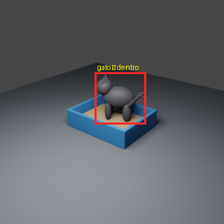

# LitterWatch : monitor de visitas à caixa de areia

Projeto final do FastCamp de Dados Sintéticos para Inteligência Artificial e
Visão Computacional da EMC/UFG.

O LitterWatch demonstra um pipeline de visão computacional que gera dados
sintéticos no Blender, treina um detector de gatos e contabiliza visitas a uma
caixa de areia. O sistema é uma prova de conceito acadêmica e **não realiza
diagnóstico veterinário**.



## Objetivo

Detectar a presença de um gato na região da caixa de areia e transformar
detecções consecutivas em eventos de visita com início, fim e duração.
Alterações de frequência podem motivar observação do animal, mas não confirmam
micção, doença ou necessidade clínica.

## Pipeline

```text
Blender + Python
      ↓
imagens sintéticas + caixas YOLO
      ↓
train / val / test
      ↓
YOLO26n
      ↓
detecção do gato
      ↓
máquina de estados
      ↓
contagem e duração das visitas
```

## Resultados da prova de conceito

- 60 imagens sintéticas em 320 × 320 pixels;
- 48 imagens de treino, 6 de validação e 6 de teste;
- 20 cenas `dentro`, 20 `proximo` e 20 `fora`;
- uma classe de detecção: `gato`;
- treinamento por 8 épocas em CPU;
- mAP50 de 0,942 na validação;
- mAP50 de 0,636 no teste sintético separado;
- detecção nas 6 imagens utilizadas na demonstração;
- teste da máquina de estados com duas visitas e um ruído isolado ignorado.

Os resultados medem apenas o desempenho no ambiente sintético. A diferença no
teste e a ausência de imagens reais demonstram limitações importantes.

## Estrutura

```text
src/projeto_final/
  cena_base.py             # cria gato e caixa
  gerar_dataset.py         # randomiza e gera imagens/rótulos
  validar_dataset.py       # valida YOLO e cria previews
  treinar_detector.py      # treinamento e teste
  demonstrar_detector.py   # inferência nas imagens de teste
  contar_visitas.py        # máquina de estados

data/processed/projeto_final_litterwatch/
  images/{train,val,test}/
  labels/{train,val,test}/
  data.yaml
  metadata.csv
  litterwatch.blend

outputs/projeto_final/
  anotacoes/
  predicoes_teste/
  yolo_runs/
  visitas_simuladas.csv
```

## Requisitos

- Linux;
- Blender 3.6 ou compatível;
- Python 3.12;
- dependências descritas em `requirements.txt`;
- CPU compatível com PyTorch; GPU é opcional.

O projeto foi desenvolvido em um AMD A8-5500B com Blender 3.6.23 e treinamento
em CPU.

## Instalação

```bash
python3 -m venv .venv
source .venv/bin/activate
python -m pip install --upgrade pip
python -m pip install torch torchvision --index-url https://download.pytorch.org/whl/cpu
python -m pip install -r requirements.txt
```

O comando acima instala PyTorch para CPU. Em uma máquina com GPU compatível,
use a variante indicada pela documentação do PyTorch.

Os scripts Blender possuem o caminho local do projeto em `PROJECT_DIR`.
Altere essa constante se o repositório estiver em outro diretório.

## Execução

Defina o executável do Blender de acordo com sua instalação:

```bash
BLENDER=/caminho/para/blender
```

Crie a cena-base:

```bash
"$BLENDER" -b --python src/projeto_final/cena_base.py
```

Gere e valide o dataset:

```bash
"$BLENDER" -b --python src/projeto_final/gerar_dataset.py
.venv/bin/python src/projeto_final/validar_dataset.py
```

Treine e demonstre o detector:

```bash
.venv/bin/python src/projeto_final/treinar_detector.py
.venv/bin/python src/projeto_final/demonstrar_detector.py
```

Teste a contagem de visitas:

```bash
.venv/bin/python src/projeto_final/contar_visitas.py
```

## Funcionamento da contagem

O contador usa dois quadros consecutivos para confirmar entrada ou saída. Isso
evita interpretar uma única detecção instável como nova visita. Uma implantação
real precisaria conectar essa regra às detecções de um vídeo e calibrar os
intervalos para a câmera utilizada.

## Limitações

- treinamento e teste apenas com dados sintéticos;
- modelo 3D simplificado;
- conjunto pequeno;
- ausência de câmera real;
- não diferencia micção, defecação ou simples aproximação;
- não reconhece gatos individualmente;
- não mede peso, volume, umidade ou pH;
- não possui validação clínica.

Possíveis extensões incluem imagens reais autorizadas, sensores de peso,
identificação individual e avaliação conjunta com profissionais veterinários.

## Ética e uso responsável

O LitterWatch é um projeto educacional. Alertas comportamentais não substituem
avaliação veterinária. Tentativas frequentes ou prolongadas de urinar podem
exigir atenção profissional, especialmente quando o animal apresenta dor,
vocalização ou ausência de urina.

## Documentação

- [Escopo do projeto](docs/projeto-final-escopo.md)
- [Relatório técnico](docs/relatorio-projeto-final.md)
- [Relatório oficial em PDF](entregas/Relatório%2012%20-%20Mauro%20Andrade.pdf)
- [Roteiro do pitch](docs/pitch-projeto-final.md)
